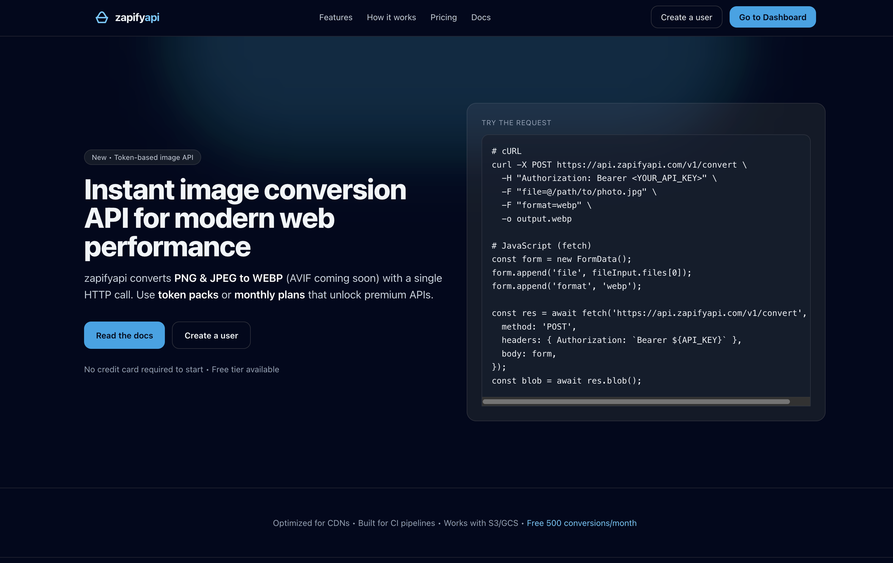
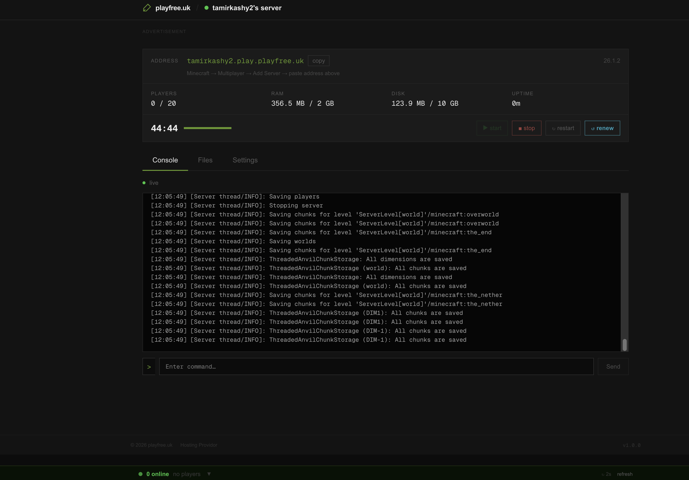

# Tamir Shevchenko Kashy

**Computer Science undergraduate (HIT, expected 2027). I build and run production web services.**

Most of my work is live software with real users, billing, and uptime concerns rather than practice projects. You can sign up and use both of the products below right now, and the MCP server is published on npm.

---

## What I'm running

[](https://zapifyapi.com)

### [zapifyapi.com](https://zapifyapi.com) — Multi-API Platform & MCP Server

A self-serve API platform hosting 30 tools across image processing, NLP, network diagnostics, developer utilities and data conversion — with an API store, per-project keys, and a points-based metering system.

- **MCP server published on npm** as [`@zapifyapi/mcp-server`](https://www.npmjs.com/package/@zapifyapi/mcp-server) — exposes all 30 tools to AI agents over stdio. Works with Claude Desktop, Kiro, and any MCP-compatible client.
- **Agent discovery endpoints** — MCP manifest, OpenAI `ai-plugin.json`, and an OpenAPI spec, so agents can find and integrate the platform without manual configuration.
- **Auth and metering** — Bearer API-key authentication, per-key rate limiting, signed URLs, and per-request point deduction with pay-as-you-go packs and subscription tiers.
- **Project model** — separate API keys and point balances per project, with a self-serve dashboard for key management and live usage.

**Stack:** PHP · JavaScript · TypeScript · MySQL · MCP SDK

Drop this into your MCP client config and all 30 tools are available to the agent:

```json
{
  "mcpServers": {
    "zapifyapi": {
      "command": "npx",
      "args": ["@zapifyapi/mcp-server"],
      "env": { "ZAPIFYAPI_TOKEN": "your_token" }
    }
  }
}
```

[Docs](https://zapifyapi.com/docs/guide-mcp) · [Get a free token](https://zapifyapi.com/signup) — free plan includes 1,000 points/month

---

[](https://playfree.uk)

### [playfree.uk](https://playfree.uk) — On-Demand Game Server Hosting

Free Minecraft Java server hosting that provisions an isolated server per user in 30–60 seconds.

- Orchestrates the Pterodactyl API to provision, boot, and tear down containerised game servers on demand
- Session-based lifecycle with world state persisted across restarts
- Priority queue and tiered resource quotas (RAM, disk, player cap, concurrent servers) to keep a free tier sustainable on fixed capacity
- Automated per-user subdomain allocation via DNS SRV records — players connect on a stable address with no IP or port
- Live dashboard reporting servers online, queue depth, and active players

**Stack:** Next.js · PHP · Docker · Pterodactyl · Coolify

---

## Background

Three years of enterprise IT and networking field work before and alongside my degree — Centrex IP telephony deployments, voice VLAN and QoS design, and nationwide hardware rollouts for enterprise clients including Strauss Group and Microsoft. At Strauss I built an automated network-based imaging pipeline that scaled concurrent device provisioning from 2 to 10+.

That background is why I tend to think about the deployment and operating cost of a system, not just the code.

---

## Currently

- **B.Sc. Computer Science, Holon Institute of Technology** — Machine Learning, Computability & Complexity, Automata & Formal Languages
- Extending the ZapifyAPI tool catalogue and its MCP integration

**Working with:** TypeScript · PHP · JavaScript / Next.js · C# / .NET · Python · C / C++ · SQL · MongoDB · Docker · Linux · MCP

---

## A note on private repositories

Most repos here are private — they're either client work or the source behind the products above. The MCP server is published publicly on npm as [`@zapifyapi/mcp-server`](https://www.npmjs.com/package/@zapifyapi/mcp-server). I'm happy to walk through architecture, design decisions, or code directly in an interview.

---

📫 **tamirkashy13@gmail.com** · [LinkedIn](https://www.linkedin.com/in/tamir-shevchenko-kashy)
